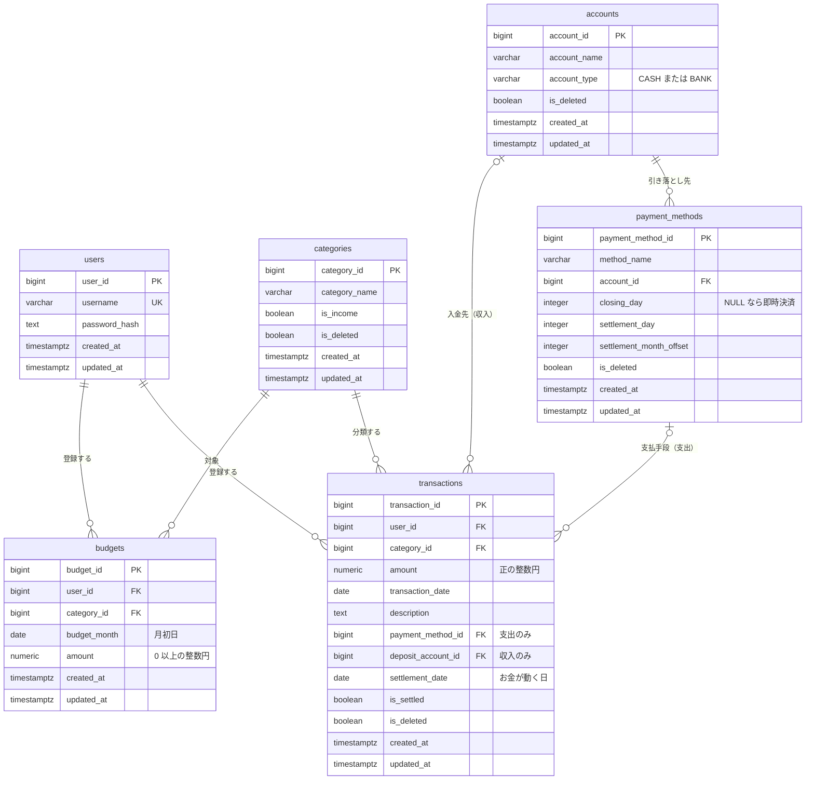

# DB 再設計ノート（R1: 6 テーブル）

- 作成: 2026-10-08
- 対象: R1 で構築する 6 テーブル（users / categories / accounts / payment_methods / transactions / budgets）
- 位置づけ: 旧版（kakeibo / kakeibo_batch）のスキーマを棚卸しした Before 分析と、新設計の方針・ER 図。DDL の正は `db/migrations`（R1-02）で、本書は「なぜその列・制約があるか」を残す

## 1. 旧スキーマの棚卸し（Before）

旧版の設計文書（2026-03 時点・13 テーブル）と、同時期の pg_dump の構造、旧アプリのコードを突き合わせた結果。R1 で作り直す 6 テーブルに関わる 8 件と、後続リリースへの申し送り 1 件。

### 1-1. 採番方式が文書と現物で食い違い、現物も 4 通り

- 何が: 文書の DDL は MySQL 構文の `AUTO_INCREMENT` で、PostgreSQL では実行できない。現物は「シーケンス＋`DEFAULT nextval`」（SERIAL 相当）、`GENERATED ALWAYS AS IDENTITY`、`GENERATED BY DEFAULT AS IDENTITY`、採番なし（人が ID を決める）の 4 通りが混在していた
- なぜ問題か: 手入力 ID の可否とカウンタの追従がテーブルごとに違い、シード投入や移行の手順が表ごとに変わる。SERIAL 相当は手入力後にカウンタが追従せず、後日の自動採番が重複する
- 対応: 全テーブル `GENERATED ALWAYS AS IDENTITY` に統一。旧 ID を引き継ぐシードだけ `INSERT ... OVERRIDING SYSTEM VALUE` で投入し、直後に `setval` でカウンタを進める

### 1-2. 設計文書が現物を表していない

- 何が: 文字列長は文書 VARCHAR(50) に対し現物 varchar(255)、金額は文書 NUMERIC(10,2) に対し現物 numeric(38,2)。255 と (38,2) は JPA が Entity から DDL を自動生成した時の既定値で、文書の値は一度も現物と一致していなかった。収入の入金先 `deposit_account_id` は後から `ALTER TABLE` で足されたが、文書には無い
- なぜ問題か: 「文書と現物のどちらが正か」が言えない。文書を読んでも列の存在すら分からない
- 対応: DDL の正は `db/migrations` に一本化し、本書は理由だけを書く。`deposit_account_id` は R1 の初期スキーマに含める（原則「データ先行・処理後追い」の具体例。§2）

### 1-3. 外部キーの型が参照先と一致していない

- 何が: 集計表の `category_id` は BIGINT で、参照先 `categories.category_id` は INTEGER。集計表の `total_amount` は NUMERIC(12,2) で、NUMERIC(38,2) の合計を受けていた
- なぜ問題か: PostgreSQL は型が違っても外部キーを張れるが、JOIN のたびに暗黙の型変換が入り、アプリ側（Rust の sqlx）に型の読み替えが漏れていた。合計列の精度は理論上の桁あふれを許していた
- 対応: 主キー・外部キーは全テーブル BIGINT で統一し、「外部キー列は参照先と同じ型」を規約にする。合計を受ける列は元の列より精度を広げる（R3 のマートで適用）

### 1-4. 業務ルールがコメントとアプリ側の約束だけで、DB 制約になっていない

- 何が: 口座種別の値集合、決済日の範囲、収入／支出で参照列を使い分ける排他、予算の「カテゴリ×月で 1 件」の一意性が、いずれも DB に無かった。フラグ列（`is_deleted` など）は NULL 可で、`WHERE is_deleted = false` の条件から NULL の行が黙って漏れる。`password_hash` も NULL 可だった
- なぜ問題か: アプリが規約を破った時に DB が止めず、重複や消失が静かに起きる。予算は find してから insert する実装で一意性を守り、重複行を `SUM` が隠していた
- 対応: CHECK・UNIQUE・NOT NULL で DB に持たせる（§4 の各テーブル）。真偽値と日時は全て NOT NULL

### 1-5. 日時の時刻帯が曖昧

- 何が: 日時列は全て `timestamp without time zone`。書き手は PostgreSQL の `CURRENT_TIMESTAMP`、Java の `Instant.now()`、Rust の `Local::now().naive_local()` の 3 系統で、同じ列に別の時刻帯の値が混ざり得た
- なぜ問題か: 保存された値が JST か UTC かを DB が知らず、稼働環境を移すと過去と未来の値の意味がズレる
- 対応: `TIMESTAMPTZ` に統一（内部は UTC、表示は接続の時刻帯）。日付だけの列は DATE のまま

### 1-6. 命名が不揃い

- 何が: 主キーは `user_id` `category_id` などなのに、payment_methods だけ `payment_id`（参照側の列名は `payment_method_id`）、集計表と運用表は `id`。外部キー制約名も手付けと自動命名が混在
- なぜ問題か: JOIN のたびに列名を確かめる手間が出る。O/R マッパーの自動対応づけで Java 側にも不一致が写る
- 対応: 命名規約を一つ決めて全テーブルに適用（§3-4）。payment_methods の主キーは `payment_method_id` に改名

### 1-7. `user_id` の意味が未定義

- 何が: categories は全員共通なのに、accounts と payment_methods は `user_id NOT NULL` で、画面は全員分を表示して家族で共有していた。transactions の `user_id` は実質「入力者」、budgets は NULL 可で未設定の経路があった
- なぜ問題か: 「所有者」か「入力者」かが決まっておらず、ユーザーで絞る画面を正しく作れない
- 対応: マスタ 3 種は世帯共通として `user_id` を持たない。transactions と budgets の `user_id` は「登録者」と定義し NOT NULL

### 1-8. transactions に索引が無く、年月検索が関数で索引を使えない

- 何が: 外部キー列を含め、主キー以外の索引が無い。一覧は `TO_CHAR(transaction_date, 'YYYY-MM') = ?` で検索していた
- なぜ問題か: 列を関数に通した条件では索引が使われず、常に全件走査になる構造。PostgreSQL は外部キー列に索引を自動では作らない
- 対応: 外部キー列と検索列に索引を張る。年月の検索は「月初以上・翌月初未満」の範囲条件で書く

### 申し送り（R3 のマート設計へ）

集計表の年月は 'YYYY-MM' の文字列だった（日付演算ができない）。categories への外部キーに `ON DELETE CASCADE` が付いていた（物理削除禁止の方針と矛盾する装置）。R3 では年月を DATE の月初日にし、CASCADE は使わない。

## 2. 設計原則

- **データ先行・処理後追い。** 入力データは R1 から最終形の精度で記録し、処理（決済・残高反映・集計）は後続リリースで追いつく。処理を導入した時に、過去データがそのまま処理できること。旧版で決済機能を後付けした際に既存データが未決済のまま滞留した轍を踏まない。`settlement_date` を全行に持つこと、支払手段に決済条件を持つこと、`deposit_account_id` を最初から持つことは、この原則の具体化
- **ルールは DB に持たせる。** 値の集合・範囲・排他・一意性・NULL の可否は CHECK・UNIQUE・NOT NULL・外部キーで DB が止める。アプリの検証は利用者への案内のためで、守りの最後の砦は DB
- **DDL の正は migrations。** 文書は理由を残す場所で、列の定義を独自に持たない
- **導出できる列は持たない。** 他の列や表から計算できる列（取引の収支区分など）は、必要になった時に足す。足しても情報は失われない
- **層別設計。** この 6 テーブルは業務系（入力と参照）のマスタとファクト。分析系の画面は R3 で作るマート層だけを読む（ADR-003）。R1〜R2 の予実比較だけは暫定で transactions を直接集計する

## 3. 横断の規約

### 3-1. ID と採番

- 主キー・外部キーは BIGINT。Java は `Long`、Rust は `i64`
- 主キーは `GENERATED ALWAYS AS IDENTITY`。アプリは ID を送らない
- 旧 ID を引き継ぐシードは `INSERT ... OVERRIDING SYSTEM VALUE` で投入し、`setval` でカウンタを最大値の次に進める

### 3-2. 金額

- NUMERIC(12, 0)。円に小数は無いので整数で持つ。`BigDecimal`（Java）・`BigDecimal`（Rust の bigdecimal）に対応
- 合計を受ける列は元の列より精度を広げる（桁は R3 で決める）

### 3-3. 日時と日付

- 日時は `TIMESTAMPTZ`。`created_at` と `updated_at` を全テーブルの末尾に `NOT NULL DEFAULT now()` で置く
- `created_at` は DB の既定値に任せ、アプリは触らない。`updated_at` はアプリが更新のたびに入れる（Spring Data JPA の監査機能。素の JDBC・Rust・手作業の SQL は UPDATE 文に `updated_at = now()` を書く）。書き手が増えてズレが出たら、その時に DB トリガーへ切り替える
- 日付だけの列は DATE
- 接続の時刻帯は Asia/Tokyo を設定で明示する。保存は UTC、表示は JST

### 3-4. 命名

- 表名は複数形の snake_case、列名は snake_case
- 主キーは `単数形_id`。外部キー列は参照先の主キー名をそのまま使い、同じ表を別の役割で指す時だけ役割を前に付ける（`deposit_account_id`）
- 真偽値は `is_`、日付は `_date`、日時は `_at`
- 制約と索引は全て明示的に命名する。`pk_表名`、`uq_表名_対象`、`fk_表名_参照先`、`ck_表名_意味`、`ix_表名_列名`

### 3-5. NULL と論理削除

- 真偽値・日時・外部キー（必須のもの）は NOT NULL。任意の参照だけ NULL を許し、CHECK で組み合わせを縛る
- 自由記述は `TEXT NOT NULL DEFAULT ''`（未記入は空文字）
- 論理削除の対象は categories / accounts / payment_methods / transactions（`is_deleted`）。users と budgets は対象外。物理削除はしない
- 値の集合は VARCHAR＋CHECK で縛る（ENUM 型は使わない）

### 3-6. 文字列長と索引

- 名前系（`username` `category_name` `account_name` `method_name`）は VARCHAR(50)
- 外部キー列と検索列に索引を張る。主キーと UNIQUE の索引は DB が作る

## 4. テーブル別の設計

### 4-1. users（利用者）

ログインの主体。家族 2 人程度の世帯を想定し、権限の区別は持たない（必要になった時に列を足す）。

| 列 | 型 | 制約 | 意味 |
|---|---|---|---|
| user_id | BIGINT | pk_users、IDENTITY | 主キー |
| username | VARCHAR(50) | NOT NULL、uq_users_username | ログイン ID 兼表示名 |
| password_hash | TEXT | NOT NULL | BCrypt のハッシュ（60 文字。方式変更に備え長さは縛らない） |
| created_at | TIMESTAMPTZ | NOT NULL DEFAULT now() | |
| updated_at | TIMESTAMPTZ | NOT NULL DEFAULT now() | |

### 4-2. categories（カテゴリ）

収支の分類。世帯共通。収入か支出かはカテゴリが決め、取引はそれに従う。

| 列 | 型 | 制約 | 意味 |
|---|---|---|---|
| category_id | BIGINT | pk_categories、IDENTITY | 主キー |
| category_name | VARCHAR(50) | NOT NULL | 表示名 |
| is_income | BOOLEAN | NOT NULL DEFAULT false | true なら収入カテゴリ |
| is_deleted | BOOLEAN | NOT NULL DEFAULT false | 論理削除 |
| created_at | TIMESTAMPTZ | NOT NULL DEFAULT now() | |
| updated_at | TIMESTAMPTZ | NOT NULL DEFAULT now() | |

### 4-3. accounts（口座）

お金の置き場。現金と銀行口座。クレジットカードは置き場ではなく支払手段なので、ここには置かない。世帯共通。

| 列 | 型 | 制約 | 意味 |
|---|---|---|---|
| account_id | BIGINT | pk_accounts、IDENTITY | 主キー |
| account_name | VARCHAR(50) | NOT NULL | 表示名 |
| account_type | VARCHAR(20) | NOT NULL、ck_accounts_account_type: IN ('CASH', 'BANK') | 種別。値を足す時は CHECK を作り直す |
| is_deleted | BOOLEAN | NOT NULL DEFAULT false | 論理削除 |
| created_at | TIMESTAMPTZ | NOT NULL DEFAULT now() | |
| updated_at | TIMESTAMPTZ | NOT NULL DEFAULT now() | |

### 4-4. payment_methods（支払手段）

支出の支払い方。現金払い・各カードなど。決済された時にどの置き場から出ていくかを `account_id` で必ず指す。カードは約款どおりの決済条件を持ち、即時決済の手段は条件の 3 列を全て NULL にする。世帯共通。

| 列 | 型 | 制約 | 意味 |
|---|---|---|---|
| payment_method_id | BIGINT | pk_payment_methods、IDENTITY | 主キー（旧 payment_id を改名） |
| method_name | VARCHAR(50) | NOT NULL | 表示名 |
| account_id | BIGINT | NOT NULL、fk_payment_methods_account → accounts | 決済時に残高が動く置き場 |
| closing_day | INTEGER | NULL 可 | 締め日（1〜31。31 は月末の意味） |
| settlement_day | INTEGER | NULL 可 | 支払日（1〜31） |
| settlement_month_offset | INTEGER | NULL 可 | 締め月の何ヶ月後に支払うか（1 = 翌月、2 = 翌々月） |
| is_deleted | BOOLEAN | NOT NULL DEFAULT false | 論理削除 |
| created_at | TIMESTAMPTZ | NOT NULL DEFAULT now() | |
| updated_at | TIMESTAMPTZ | NOT NULL DEFAULT now() | |

- ck_payment_methods_settlement_terms: 3 列が全て NULL（即時決済）か、全て NOT NULL で `closing_day` と `settlement_day` が 1〜31、`settlement_month_offset` が 1〜2
- ix_payment_methods_account_id
- 決済日の計算規則（存在しない日の扱いを含む）は ADR-004 で決め、R1-11 で実装する。本表はその計算に必要な材料を R1 から持つ

### 4-5. transactions（取引）

収入と支出の事実。金額は常に正で、収入か支出かはカテゴリが決める。支出は支払手段を、収入は入金先口座を、どちらか一方だけ指す。`settlement_date` は「お金が実際に動く日」で全行に持ち、収入と即時決済の支出は取引日と同じ日、カードは決済条件から計算した日が入る。

| 列 | 型 | 制約 | 意味 |
|---|---|---|---|
| transaction_id | BIGINT | pk_transactions、IDENTITY | 主キー |
| user_id | BIGINT | NOT NULL、fk_transactions_user → users | 登録者 |
| category_id | BIGINT | NOT NULL、fk_transactions_category → categories | 分類（収支の方向もここから） |
| amount | NUMERIC(12,0) | NOT NULL、ck_transactions_amount_positive: > 0 | 金額（円） |
| transaction_date | DATE | NOT NULL | 取引日 |
| description | TEXT | NOT NULL DEFAULT '' | メモ |
| payment_method_id | BIGINT | NULL 可、fk_transactions_payment_method → payment_methods | 支払手段（支出のみ） |
| deposit_account_id | BIGINT | NULL 可、fk_transactions_deposit_account → accounts | 入金先口座（収入のみ） |
| settlement_date | DATE | NOT NULL、ck_transactions_settlement_date: >= transaction_date | お金が動く日 |
| is_settled | BOOLEAN | NOT NULL DEFAULT false | 決済済み（収入と即時決済は登録時に true） |
| is_deleted | BOOLEAN | NOT NULL DEFAULT false | 論理削除（取消） |
| created_at | TIMESTAMPTZ | NOT NULL DEFAULT now() | |
| updated_at | TIMESTAMPTZ | NOT NULL DEFAULT now() | |

- ck_transactions_method_or_deposit: `(payment_method_id IS NULL) <> (deposit_account_id IS NULL)`。支払手段と入金先のどちらか一方だけを持つ。支出に支払手段が無い行、収入に入金先が無い行は作れない
- 索引: ix_transactions_transaction_date、ix_transactions_settlement_date、ix_transactions_user_id、ix_transactions_category_id、ix_transactions_payment_method_id、ix_transactions_deposit_account_id
- 収支の方向を取引自身に持つ列（`transaction_type`）は置かない。カテゴリから導けるので、必要になった時に足して埋める

### 4-6. budgets（予算）

カテゴリ×月の予算額。世帯で一つ。取り消しは金額 0 で表し、行は消さない。

| 列 | 型 | 制約 | 意味 |
|---|---|---|---|
| budget_id | BIGINT | pk_budgets、IDENTITY | 主キー |
| user_id | BIGINT | NOT NULL、fk_budgets_user → users | 登録者（最後に更新した人） |
| category_id | BIGINT | NOT NULL、fk_budgets_category → categories | 対象カテゴリ（収入カテゴリも可） |
| budget_month | DATE | NOT NULL、ck_budgets_budget_month_first_day: 月初日に限定 | 対象月（その月の 1 日） |
| amount | NUMERIC(12,0) | NOT NULL、ck_budgets_amount_non_negative: >= 0 | 予算額（円） |
| created_at | TIMESTAMPTZ | NOT NULL DEFAULT now() | |
| updated_at | TIMESTAMPTZ | NOT NULL DEFAULT now() | |

- uq_budgets_category_month: UNIQUE (category_id, budget_month)。登録・更新は `INSERT ... ON CONFLICT DO UPDATE` 一文で書ける
- ix_budgets_user_id

## 5. ER 図

線の読み方: `||` はちょうど 1、`|o` は 0 か 1、`o{` は 0 以上。transactions から accounts と payment_methods への線が `|o` なのは、取引ごとにどちらか一方だけを指すため。

## 6. 後続リリースへの申し送り

- R2（決済処理・残高・資金移動）: `settlement_date` と `is_settled` を処理の入力にする。`payment_methods.account_id` が必須なので、反映先の無い取引は存在しない。R1 で登録された未決済取引の整理タスクを R2 に置く
- R3（マート）: 年月は DATE の月初日、合計列は精度を広げる、`ON DELETE CASCADE` は使わない。`updated_at` の書き手が Rust に増えるので、ズレが出れば DB トリガーに切り替える
- ADR-004（決済日の計算規則）: `closing_day` `settlement_day` `settlement_month_offset` を材料に、存在しない日の扱いを決める
- 必要になった時に足す列: transactions の収支区分（カテゴリとの整合は複合外部キーで守れる）、users の権限、マスタ名の一意制約（R2 のマスタ管理画面と合わせて検討）
